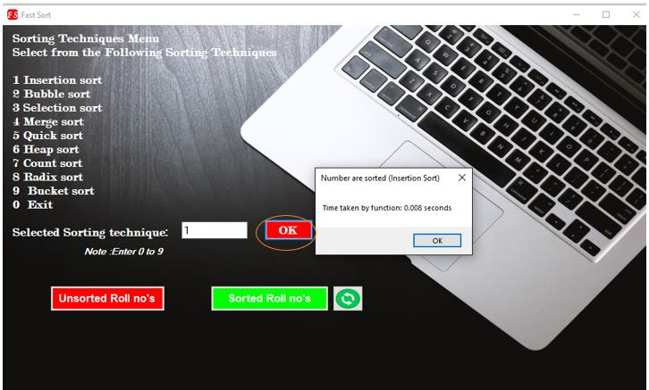
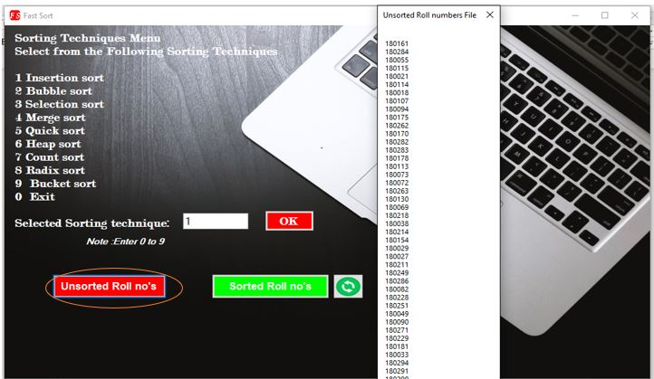
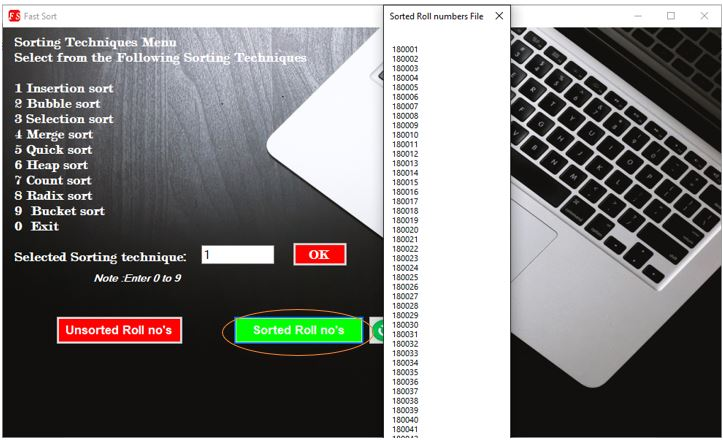

# FAST-Sort
Sorting Algorithms windows Application (like selection sort , quick sort ,merge sort, Bubble sort,Radix sort and Insertion sort) 

Design and implement a menu-based software to sort the roll numbers. Program will prompt the user to select unsorted text file containing roll numbers, then program will prompt the user to select the sorting technique to apply, after that new file containing sorted roll numbers must be displayed and saved. You are only allowed to use only **C++ language.** 

## Windows Form Outputs:

 

Asymptotic Analysis and running time comparison of sorting algorithms and fill the following table.

<pre>S.No	Techniques	     Running time (code execution)	Asymptotic Time (Worst)</pre>

1.   <pre>Insertion sort	      0.008 seconds	                     O(N2)</pre>

1.   <pre>Bubble sort	         0.009 seconds	                     O(N2)</pre>

1.   <pre>Selection sort        0.006 seconds	                     O(N2)</pre>

1.	 <pre>Merge sort	         0.01 seconds	                       O(N log N)</pre>

1.	 <pre>Quick sort           0.014 seconds	                     O(N2)</pre>

1.	 <pre>Heap sort	           0.011 seconds	                     O(N log N)</pre>

1.	 <pre>Count sort	         0.013 seconds	                     O(N + k)</pre>

1.	 <pre>Radix sort	         0.011 seconds	                     O(N k)</pre>

1.	<pre> Bucket sort	         0.013 seconds	                     O(N2)</pre>

